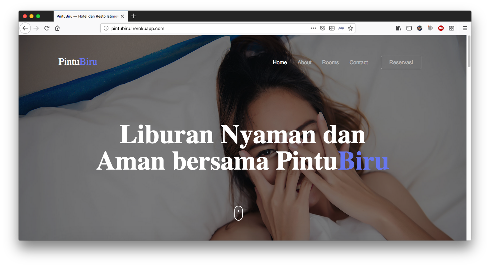
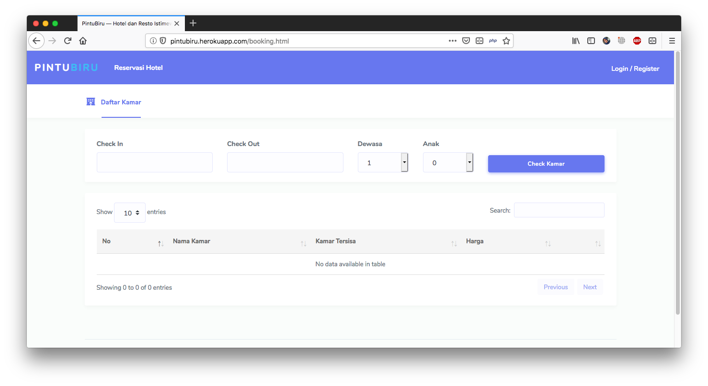
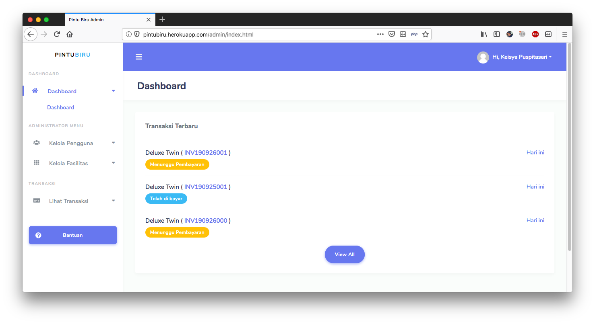

  <a href="#">
		<h1 align="center">PintuBiru-OnlineBooking hotel</h1>
  </a>

  PintuBiru merupakan project OpenSource yang di kembangkan oleh Oratkashi Nhamako aka Key, seorang software enginering yang sangat senang dengan programming dan ingin berbagi kepada para pelajar / mahasiswa yang baru dan ingin belajar tentang web programming, Project ini free dan open source (Boleh di kembangkan lagi)

 

 

 
Tampilan HomeScreen.

 

  

 
Tampilan Booking Kamar.

 

  

 
Tampilan Administrator.

 

 <h1>License</h1>
 
PintuBiru is under the [MIT License](LICENSE)

